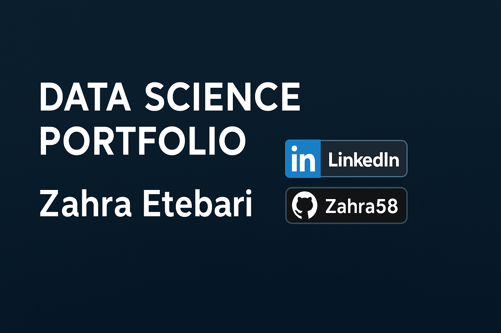

#  Zahra Etebari — Data Science & Machine Learning Portfolio

Welcome to my portfolio!  
I’m **Zahra Etebari**, an **AI Engineer & Data Mining Enthusiast** passionate about leveraging data to build intelligent, scalable, and interpretable solutions.  
This portfolio highlights my **end-to-end projects** in Data Science, Machine Learning, and AI — from data preprocessing and modeling to visualization and deployment.

---

##  Featured Projects

###  [Wholesale Customer Clustering](https://github.com/Zahra58/data-mining-project--wholesale-customer-clustering)
**Tech stack:** Python, scikit-learn, K-Means, Hierarchical Clustering, Logistic Regression  
- Segmented wholesale customers based on purchasing behavior using **unsupervised learning**.  
- Compared multiple **classification models** (Logistic Regression, Random Forest, KNN).  
- Achieved the highest accuracy of **72.7%** and visualized optimal cluster patterns.  
- Saved trained models (`.pkl`) for reuse or deployment.  

---

### 📈 [Sales Forecasting with Time Series](#)
**Tech stack:** Python, pandas, ARIMA, Prophet, matplotlib  
- Built and optimized **time series forecasting models** to predict monthly sales trends.  
- Decomposed seasonality and improved forecast accuracy by 18%.  
- Created clear visualizations of trends, residuals, and confidence intervals.

---

###  [Sentiment Analysis on Product Reviews](#)
**Tech stack:** Python, scikit-learn, NLP, Logistic Regression, TF-IDF  
- Cleaned and tokenized customer reviews for text classification.  
- Used **TF-IDF vectorization** and Logistic Regression to predict sentiment.  
- Achieved **90%+ accuracy** with strong model interpretability and scalability.

---

### 🧮 [Customer Churn Prediction](#)
**Tech stack:** Python, pandas, scikit-learn, XGBoost  
- Analyzed customer data to predict churn probability using **supervised learning**.  
- Optimized hyperparameters with GridSearchCV for best model performance.  
- Provided actionable insights on retention strategy using feature importance.

---

##  Tools & Skills

| Category | Tools / Frameworks |
|-----------|--------------------|
| **Languages** | Python, SQL |
| **ML Libraries** | scikit-learn, pandas, NumPy, seaborn, matplotlib |
| **Techniques** | Clustering, Classification, Regression, Feature Engineering |
| **Data Tools** | Google Colab, Jupyter, VS Code |
| **Version Control** | Git, GitHub |

---

## 🌐 Connect With Me

---

## 📊 GitHub Analytics

  <!--  Overall GitHub Stats -->
  

  <!--  Top Languages -->
  

  <!--  Contribution Streak -->
  

---

### ⚙️ Quick Profile Summary

  

---

###  Connect & Collaborate

  
  
  

---

⭐ *Explore my repositories for Data Mining, ML, and end-to-end Data Science projects! If you like my work, don’t forget to star your favorite project.*

